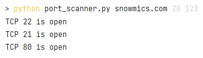
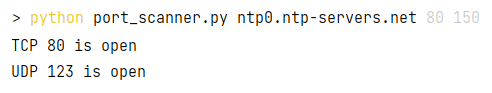

# Сканер TCP и UDP портов

Задание выполнил Страхов Ярослав, студент группы КН-201.

## Описание

Реализация сканера открытых TCP и UDP портов у указанного хоста 
в заданном диапазоне.

## Использование

Запуск скрипта: 

``python port_scanner.py ХОСТ НАЧАЛЬНЫЙ_ПОРТ КОНЕНЧНЫЙ_ПОРТ``

## Примеры запуска программы

